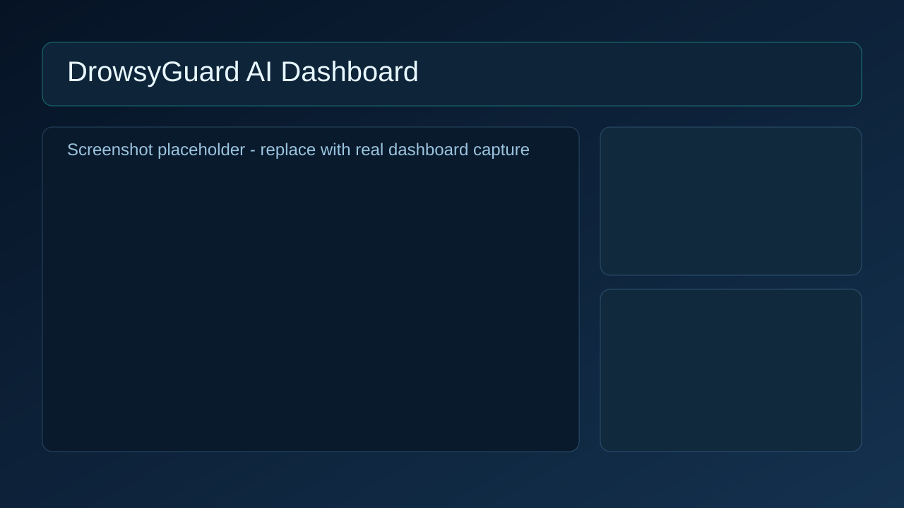
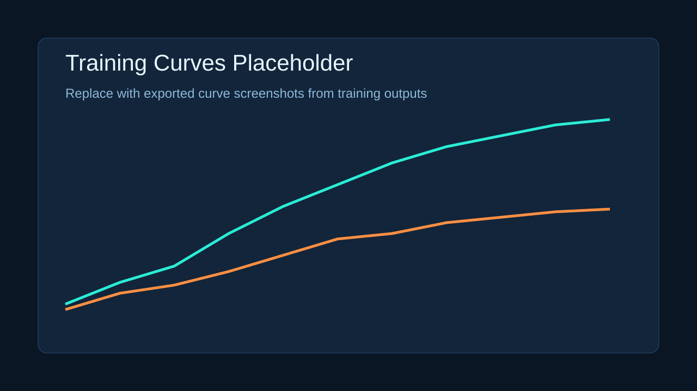

# DrowsyGuard AI

DrowsyGuard AI is a modular, production-ready, real-time driver monitoring system that combines spatial and temporal deep learning to detect drowsiness, distraction, and microsleep events.

## Highlights

- Two-stage AI pipeline:
  - Stage 1: ResNet-50 eye-state classifier (`Open`, `Closed`, `Half`)
  - Stage 2: Bidirectional LSTM temporal classifier (`Awake`, `Drowsy`, `Distracted`, `Microsleep`)
- Real-time detection from webcam stream over WebSocket
- FastAPI backend with REST and WebSocket endpoints
- Next.js + Tailwind + Framer Motion frontend dashboard
- Advanced fatigue analytics:
  - Attention Score (0-100)
  - Blink Rate detection
  - Eye Aspect Ratio (EAR)
  - Fatigue trend graph (last 60 seconds)
  - Voice alert with audible alarm
- Dockerized backend and frontend orchestration with docker-compose

## Architecture

```mermaid
flowchart LR
    A[Webcam Frames - Frontend] --> B[WebSocket Client]
    B --> C[FastAPI Live Detection Endpoint]
    C --> D[Video Processor]
    D --> E[MediaPipe Face + Eye ROI]
    E --> F[Stage 1 - ResNet50 Eye Classifier]
    F --> G[Rolling Buffer - 20 timesteps of 3D probabilities]
    G --> H[Stage 2 - BiLSTM Temporal Classifier]
    H --> I[Driver State + Confidence]
    I --> J[Attention/Blink/EAR/Fatigue Analytics]
    J --> K[Dashboard Overlay + Alerts]
```



## Monorepo Structure

```text
drowsyguard-ai/
├── backend/
│   ├── app/
│   │   ├── main.py
│   │   ├── routes/
│   │   │   ├── inference.py
│   │   │   ├── health.py
│   │   ├── models/
│   │   │   ├── eye_model.py
│   │   │   ├── lstm_model.py
│   │   ├── services/
│   │   │   ├── inference_service.py
│   │   │   ├── video_processor.py
│   │   ├── utils/
│   │   │   ├── preprocessing.py
│   │   │   ├── mediapipe_utils.py
│   │   ├── config.py
│   ├── weights/
│   │   ├── eye_classifier.pth
│   │   ├── drowsiness_lstm.pth
│   ├── tests/
│   │   ├── test_api.py
│   ├── requirements.txt
│   └── Dockerfile
├── frontend/
│   ├── components/
│   │   ├── WebcamFeed.jsx
│   │   ├── StatusIndicator.jsx
│   │   ├── ConfidenceBar.jsx
│   │   ├── AlertSystem.jsx
│   ├── pages/
│   │   ├── _app.js
│   │   ├── index.js
│   ├── services/
│   │   ├── websocket.js
│   ├── styles/
│   │   ├── globals.css
│   ├── package.json
│   └── Dockerfile
├── training/
│   ├── train_eye_model.py
│   ├── train_lstm_model.py
│   ├── dataset_loader.py
│   ├── augmentations.py
├── data/
│   ├── eye_state/
│   ├── sequences/
├── notebooks/
│   ├── EDA.ipynb
├── docs/
│   ├── screenshots/
│   │   ├── dashboard.svg
│   │   ├── training_curves.svg
├── docker-compose.yml
└── README.md
```

## Model Design

### Stage 1: Spatial Eye-State Model

- Backbone: torchvision ResNet-50 (ImageNet pretrained)
- Transfer learning strategy:
  - Freeze early backbone layers
  - Fine-tune later layers (`layer3`, `layer4`, and custom classifier)
- Input: `64x64` RGB eye image
- Output classes: `Open`, `Closed`, `Half`
- Head:
  - `Linear -> ReLU -> Dropout -> Linear -> ReLU -> Dropout -> Linear`
- Loss: CrossEntropyLoss
- Optimizer: Adam
- Scheduler: StepLR

### Stage 2: Temporal Sequence Model

- Architecture: Bidirectional LSTM
- Input size: `3` (Open/Closed/Half probabilities)
- Sequence length: `20`
- Hidden size: `128`
- Layers: `2`
- Output classes: `Awake`, `Drowsy`, `Distracted`, `Microsleep`

## Real-Time Inference Pipeline

1. Frontend captures webcam frames.
2. Frames are sent to backend via WebSocket.
3. Backend decodes frame and detects face/eyes using MediaPipe.
4. Eye crops are resized and normalized.
5. Stage 1 model predicts eye-state probabilities.
6. Last 20 probability vectors are buffered.
7. Stage 2 model predicts temporal state.
8. Backend computes advanced signals and returns JSON.
9. Frontend renders overlays, confidence bars, fatigue trend, and alerts.

## API

### Health Check

- `GET /health`

Response:

```json
{
  "status": "ok",
  "service": "drowsyguard-ai-backend"
}
```

### Single Image Prediction

- `POST /predict-image`
- Body:

```json
{
  "image": "data:image/jpeg;base64,...",
  "session_id": "optional-session-key"
}
```

### Live Detection

- `WebSocket /live-detection`
- Send JSON messages:

```json
{
  "image": "data:image/jpeg;base64,..."
}
```

- Receive prediction payload containing:
  - `label`
  - `confidence`, `confidence_pct`
  - `eye_probabilities`
  - `temporal_probabilities`
  - `ear`
  - `blink_rate_per_min`
  - `attention_score`
  - `fatigue_trend`
  - `alarm`
  - overlay bounding boxes

## Dataset Format

### Eye dataset (`data/eye_state`)

- `open/`
- `closed/`
- `half/`

### Sequence dataset (`data/sequences`)

Use `.npz` files with:

- `sequence`: `shape [20, 3]`
- `label`: integer in `[0, 1, 2, 3]`

## Training

From repository root:

```bash
cd backend && pip install -r requirements.txt && cd ..
```

Train eye model:

```bash
cd training
python train_eye_model.py --data-dir ../data/eye_state
```

Train LSTM model:

```bash
python train_lstm_model.py --data-dir ../data/sequences
```

Training outputs are saved under `training/outputs/*`:

- `metrics.json`
- `training_curves.png`
- `confusion_matrix.png`

## Evaluation Metrics

Both training scripts compute and export:

- Accuracy
- Precision
- Recall
- F1-score
- Confusion Matrix
- Loss and Accuracy curves

## Local Development

### Backend

```bash
cd backend
pip install -r requirements.txt
uvicorn app.main:app --host 0.0.0.0 --port 8000 --reload
```

### Frontend

```bash
cd frontend
npm install
npm run dev
```

Open `http://localhost:3000`.

## Docker Deployment

From repository root:

```bash
docker compose up --build
```

Services:

- Frontend: `http://localhost:3000`
- Backend: `http://localhost:8000`

## Testing

Sample test script:

```bash
cd backend
pytest tests/test_api.py -q
```

## Screenshots

Dashboard placeholder:



Training curves placeholder:



## Notes for Production

- Replace placeholder model weights in `backend/weights` with trained checkpoints.
- For best latency, run backend on GPU-enabled host.
- Add authentication and rate limiting for public deployments.
- Add CI/CD for automated tests and container build checks.
